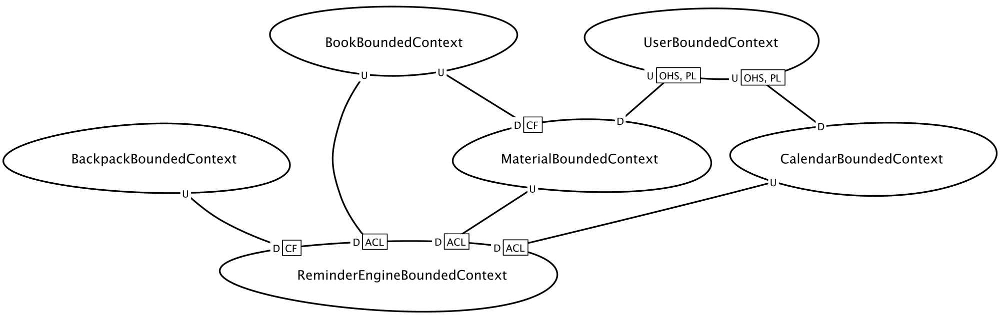

# Bounded Contexts
Di seguito sono mostrate le Bounded Context Canvas, ovvero card speciali che mostrano i dettagli di un singolo Bounded Context. Di seguito una piccola leggenda sulle varie classificazioni utilizzate.

## Strategic Classification

### Importanza del BC sul successo del progetto e dell'organizzazione:
- core domain: una iniziativa strategica chiave per il progetto e il suo successo
- supporting domain: necessario allo sviluppo e funzionamento, ma non un ke point tale da differenziarsi nel mercato o portare vantaggio dal punto di vista della concorrenza
- generic: un contesto comune presente in altri domini, anche totalmente differenti
### Ruolo che il BC gioca nel nostro modello di Business:
- revenue generator: le persone pagano per questo preciso servizio o sistema
- engagement creator: agli utenti piace ma non vogliono dover pagare per averlo, quasi fosse scontato per il coinvolgimento degli utenti
- compliance enforcer: protegge il la reputazione e l'esistenza del nostro business nel mercato
### Come verrà sviluppato o evoluto il BC nel suo ciclo di vita:
- genesis: nuovi domini inesplorati
- custom built: compagnie realizzano la loro versione da immettere nel mercato, ognuno con la propria soluzione
- product: versioni off-the-shelf esistono
- commodity: versioni e soluzioni altamente standardizzate esistono

## Domain Roles
Di seguito verranno analizzati i ruoli di dominio utilizzati nella stesura delle canvas, l'elenco completo su cui è stato fatto riferimento è presente al seguente <a href="https://github.com/ddd-crew/bounded-context-canvas/blob/master/resources/model-traits-worksheet.md"> link </a>.
- Approver Context: riceve richieste e determina se queste possono proseguire allo step successivo del processo in questione
- Execution Context: esegue o tiene traccia, monitorando, un lavoro
- Storage Context: gestisce basi di dati permanenti o volatili, in modo da offrire il loro accesso mediante opportune politiche
- Gateway Context: si pone all'estremo di un sistema e gestisce le comunicazioni inbound e outbound

## Sottodomini
I sottodomini analizzati rispiecchiano gli Emerging Bounded Context già visti in fase di Event Storming, ovvero dal raggruppamento naturale scaturito nell'attaccare i post-it alla lavagna virtuale. Più nello specifico, i sottodomini sono i seguenti, con la relativa classificazione strategia:

| Sottodominio                     | Classificazione Strategica                                                                                              |
| -------------------------------- | ----------------------------------------------------------------------------------------------------------------------- |
| Gestione libri                   | <i style="border-radius: 10px; color:black; background-color: lightgreen; padding: 5px;"> Generic </i>                  |
| Gestione utenti                  | <i style="border-radius: 10px; color:black; background-color: lightgreen; padding: 5px;"> Generic </i>                  |
| Gestione calendario              | <i style="border-radius: 10px; color:black; background-color: yellow; padding: 5px;"> Supporting </i>                   |
| Reminder Engine                  | <i style="border-radius: 10px; color:black; background-color: red; padding: 5px;"> Core </i>                            |
| Zaino intelligente               | <i style="border-radius: 10px; color:black; background-color: red; padding: 5px;"> Core </i>                            |
| Creazione etichette (TAG)        | <i style="border-radius: 10px; color:black; background-color: lightgreen; padding: 5px;"> Generic </i>                  |
| Fabbricazione zaini              | <i style="border-radius: 10px; color:black; background-color: lightgreen; padding: 5px;"> Generic </i>                  |
| Gestione materiale per lezioni   | <i style="border-radius: 10px; color:black; background-color: red; padding: 5px;"> Core </i>                            |
| Applicazione mobile              | <i style="border-radius: 10px; color:black; background-color: red; padding: 5px;"> Core </i>                            |

- Gestione libri: sottodominio che riguarda la registrazione di nuovi libri nel sistema, con relative copie associate composte da codice identificativo ISBN e tag RFID univoco
- Gestione utenti: sottodominio che riguarda la registrazione di nuovi utenti, i ruoli e le operazioni ad essi concesse, quindi permessi e zaini registrati
- Gestione calendario: sottodominio che prevede la creazione di calendari riservati a classi scolastiche e relativa gestione, compresa aggiunta di lezioni nei giorni scolastici da parte del professore
- Reminder Engine: sottodominio che riguarda il sistema di notifica da parte dell'applicativo mobile per lo studente, in modo da ricordare gli elementi mancanti e necessari alla lezione del giorno dopo
- Zaino intelligente: sottodominio che comprende la realizzazione dello zaino intelligente, ovvero il dispositivo embedded, e la sua relativa gestione lato cloud e registrazione
- Creazione etichette (TAG): sottodominio che riguarda la fabbricazione e scrittura dei tag RFID da associare alle copie di libri, quindi ai codici ISBN
- Fabbricazione zaini: sottodominio che prende in considerazione l'effettiva realizzazione degli zaini fisici su cui montare il dispositivo IoT che ne controlla la controparte digitale e connessa
- Gestione materiale per lezioni: sottodominio che riguarda la gestione del materiale necessario per ogni lezione presente su un qualsiasi calendario
- Applicazione mobile: semplicemente il sottodominio che comprende l'applicazione mobile e la sua realizzazione e comunicazione con gli altri sottodomini

## Context Map
Dato l'insieme di sottodomini rilevati durante l'analisi, si è proceduto nella stesura della Context Map, in modo da rappresentare effettivamente le comunicazioni esistenti tra i vari sottodomini e i ruoli che essi hanno in queste comunicazioni, le relazioni tra essi determineranno il comportamento del sistema.

  

### Conformists
Tra due BC viene messa una relazione di tipo <b> Conformist </b> quando il primo viene identificato come downstream in quanto opera come customer del servizio offerto dal secondo, adattandosi alle informazioni ricevute da esso che opera in upstream. I Bounded context che hanno questa relazione in questo caso sono i seguenti:
| Upstream        | Downstream     |
|:-------------|:------------------|
| BackpackBoundedContext | ReminderEngineBoundedContext |
| BookBoundedContext | MaterialBoundedContext   |

### Anticorruption Layer

In questa relazione troviamo un AntiCorruption Layer sul downstream del Reminder, in quanto non si adatta più ai dati inviati dall'upstream, ma ad un modello custom, la cui traduzione avviene mediante il componente ACL; questo semplifica l'insieme di termini UL da usare all'interno del customer.

| Upstream        | Downstream con ACL    |
|:-------------|:------------------|
| BookBoundedContext | ReminderEngineBoundedContext |
| MaterialBoundedContext | ReminderEngineBoundedContext   |
| CalendarBoundedContext | ReminderEngineBoundedContext   |

### Open Host Service con Published Language
In questo pattern di relazione il potere viene dato maggiormente al consumer. Il supplier è interessato a proteggere i suoi consumatori, quindi aggiungendo un servizio Open Host che traduce i termini UL del consumer a quelli del supplier, secondo opportuni protocolli detti Published Language, uno per ogni conversione (tra ubiquitous language diversi).
| OHS con PL        | Downstream |
|:-------------|:------------------|
| UserBoundedContext | MaterialBoundedContext |
| UserBoundedContext | CalendarBoundedContext |

## Bounded Context Canvas

