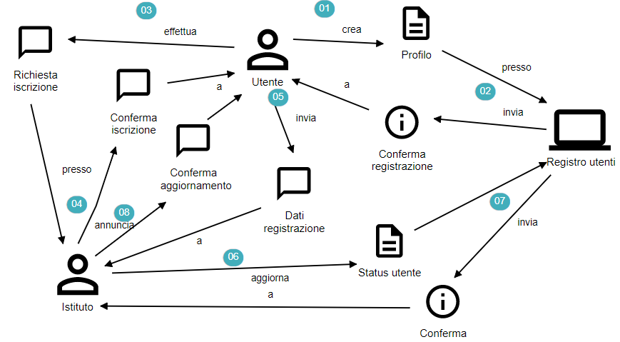
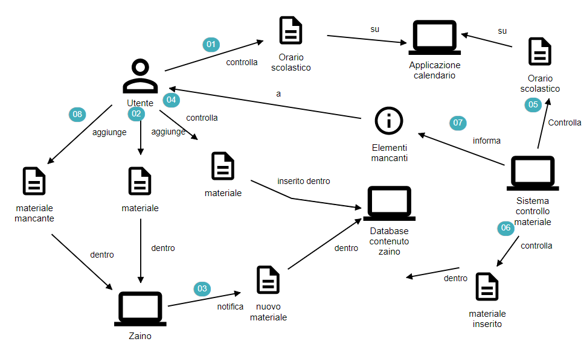
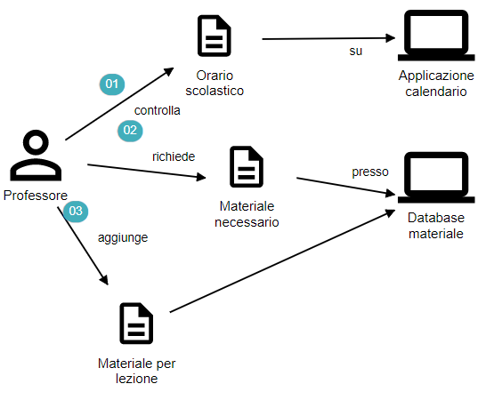
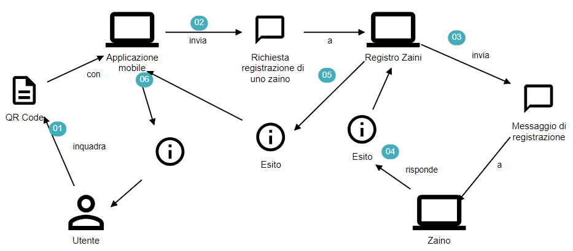

# Domain story telling e User Stories
Una delle prime analisi effettuate è stata la raccolta delle User Stories, che sono uno strumento utilizzato nello sviluppo per descrivere le esigenze degli utenti in modo semplice, rappresentando una descrizione di quello che gli utenti vogliono ottenere dall'utilizzo del sistema, il tutto in una sessione di riunione in cui si discutono gli aspetti fondamentali del sistema, in linguaggio informale ma preciso.

Sfruttando una serie di riunioni con gli esperti di dominio che ne faranno utilizzo, abbiamo quindi avviato numerose discussioni che hanno portato alla stesura delle User Stories, che descrivono ad alto livello delle azioni eseguite sul sistema, in modo informale, schematico e seguendo una logica di storytelling.
Innanzitutto ci siamo focalizzati sulla questione della creazione di un utente, quali azioni devono essere intraprese e quali entità partecipano.

## Gestione utenti e iscrizioni
L'utente, per poter usufruire del sistema, deve creare un nuovo user, inserendo le credenziali richieste (username/password). Il sistema poi provvederà ad inviare all'utente un messaggio di conferma/errore.
Effettuata la registrazione, l'utente può effetuare una richiesta di iscrizione presso un istituto (che dovrà poi prevedere se accettare/rifiutare la richiesta e segnalandolo indietro). Lo user, una volta accettato, dovrà provvedere ad inviare i propri dati, che verranno poi registrati all'interno del sistema dell'istituto e farà risultare l'utente iscritto ad un determinato istituto.

 

Flusso di lettura:
- Un'utente crea un profilo presso il registro utenti, che conferma la registrazione all'utente
- Un utente effettua una richiesta di iscrizione presso un istituto, il quale annuncia la conferma di iscrizione all'utente
- L'utente invia i dati di registrazione all'istituto, il quale aggiorna lo status utente presso il retistro utenti, che infine invia la conferma all'istituto e a sua volta conferma l'aggiornamento all'utente 

## Calendari e materiale
Una volta registrato ed iscritto ad un istituto, l'utente ha la possibilità di controllare il calendario delle lezioni.
Lo user può aggiungere oggetti nello zaino, che serviranno per la lezione del giorno dopo.
Inoltre, lo user può anche verificare quali sono gli oggetti che sono presenti all'interno dello zaino attraverso l'applicazione.
Lo zaino invece, deve controllare (in modo temporizzato) se un oggetto è stato inserito (o meno) per la lezione del giorno dopo, inviando una notifica all'utente che lo informerà del mancato inserimento
Prima e durante la lezione, l'utente deve tirare fuori elementi dallo zaino. Quando poi lo zaino identifica un movimento (presumibilmente l'utente che sta camminando con lo zaino), controlla se il contenuto attuale corrisponde col contenuto iniziale. Se lo zaino individua un elemento mancante, viene avvisato l'utente.

 

Flusso di lettura:
- L'utente controlla l'orario scolastico sull'applicazione mobile, in particolare sul calendario
- Una volta controllato il calendario, aggiunge il materiale mancante all'interno dello zaino, il quale notifica il proprio contenuto interno globale (database in cloud ad esempio)
- Il sistema di controllo dell'applicazione controlla l'orario scolastico e il materiale inserito all'interno dello zaino, informando eventualmente l'utente degli elementi mancanti

## Dal punto di vista del professore...
Il professore ha la possibilità di controllare sia l'orario scolastico delle lezioni successive, sia il materiale necessario per essi.
Ha la capacità di impostare (aggiungendo o rimuovendo) i materiali necessari per le lezioni successive.

 

Flusso di lettura:
- Un professore controlla l'orario scolastico sull'applicazione mobile, in particolare il calendario
- Un professore può richiedere qual è il materiale necessario per una data lezione previa una richiesta ad un generico database di materiale (alto livello di astrazione)
- Un professore aggiunge nuovo materiale necessario per una data lezione futura

## Registrazione degli zaini
Infine, l'immagine successiva mostra la User Story per quanto riguarda il procedimento di registrazione di uno zaino:

 

Flusso di lettura:
\item Prima di tutto, l'utente inquadra, con l'app mobile, il QR Code presente all'interno dello zaino, accoppiato al dispositivo
- L'applicazione mobile invia a questo punto una richiesta di registrazione al Registro Zaini, specificando il codice letto per riferirsi al preciso dispositivo in possesso
- Il registro degli zaini, ricevuta la richiesta, invierà un messaggio di registrazione allo zaino (non sono mostrati casi particolari in cui lo zaino è già registrato o non esistente)
- Infine, una serie di feedback in cascata riporta l'esito della registrazione all'utente, visibile con una notifica sull'applicazione smartphone